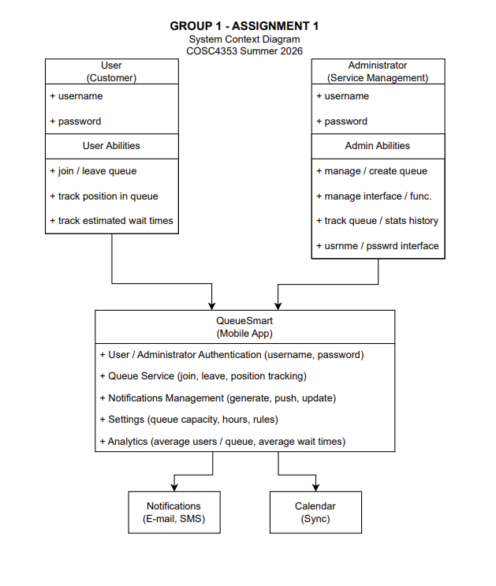

<!-- Patrick made the repository and the .md document, as well as wrote down the questions up to the second section, edited spelling and grammar in the responses, generated the System Context Diagram, and completed the "Overview Explanation" -->
<!-- I, Elvis, am the one who is editor/documentation guy (mainly formatting for now) -->

# Assignment 1: Design Analysis

## 1. Initial Thoughts

### Who are the main users of the system?
&emsp; The main users of QueueSmart are regular users and administrators. Regular users may include customers, students, 
patients, clients, or visitors who need to join a queue or schedule an appointment for a service. Administrators are staff 
members or managers who are responsible for creating services, monitoring queues, managing priorities, and improving the 
overall flow of service.

<!-- Kevin wrote/made this response -->

#### Summary | Quick Notes

<ul>
    <li>Regular Users : may include customers, students, patients, clients, or visitors who need to join a queue or schedule an appointment for a service.</li>
    <li>Administrators : staff members or managers who are responsible for creating services, monitoring queues, managing priorities, and improving the overall flow of service.</li>
</ul>

<!-- I, Elvis, wrote/made this response summary -->

### How will users and administrators interact with the application?
&emsp; Users will interact with QueueSmart by registering or logging in, selecting a service, joining a queue, viewing their
current position, checking their estimated wait time, and receiving notifications when their turn is approaching. 
Users may also leave the queue if they no longer need the service. Administrators will interact with QueueSmart through an admin
dashboard. They will be able to create and manage services, set expected service durations, assign priority levels, monitor active queues, update queue statuses, and view basic usage statistics.

<!-- Kevin wrote/made this response -->

#### Summary | Quick Notes

<ul>
    <li>Regular Users : Registering/loging into their Accounts, the able to join or leave a queue of their choosing, and view the general metrics regarding their position</li>
    <li>Administrators : Queue creation and management, publicly share desired metrics/information of a queue to the public and queuers, and view basic statistics of a given queue(s)</li>
</ul>

### What are the most important features?
&emsp; The most important features are login and registration, role-based access, service management, queue joining and leaving, 
queue position tracking, estimated wait times, notifications, and queue history. These features are important because
they help users understand their wait time while helping administrators manage demand more efficiently.

<!-- Kevin wrote/made this response -->

#### Summary | Quick Notes

<table>
  <tr>
    <td>
      <ul>
          <li>Login and registration of account</li>
          <li>Role-based access</li>
          <li>service management</li>
          <li>Joining/leaving a queue</li>
      </ul>
    </td>
    <td>
      <ul>
          <li>Queue position tracking</li>
          <li>Estimated wait times</li>
          <li>Notifications</li>
          <li>Queue history</li>
      </ul>
    </td>
  </tr>
</table>

<!-- I, Elvis, wrote/made this response summary -->

### What challenges do you anticipate (e.g., long queues, notifications, inaccurate wait times)?
&emsp; Some challenges to expect include the following: long queues, inaccurate estimated wait times, users leaving
without updating their status, users missing their turn, and notifications not being sent at the right time.
Another challenge is balancing fairness with priority, since high-priority users may need to be served sooner while
keeping the queue fair for everyone else.

<!-- Kevin wrote/made this response -->

#### Summary | Quick Notes

<table>
  <tr>
    <td>
      <ul>
          <li>Long queues</li>
          <li>Inaccurate estimated wait times</li>
          <li>Users leaving without updating their status</li>
      </ul>
    </td>
    <td>
      <ul>
        <li>Users not responding to their turn</li>
        <li>Mistimed notifications</li>
        <li>Chance of queue starvation caused by tier/class system</li>
      </ul>
    </td>
  </tr>
</table>

<!-- I, Elvis, wrote/made this response summary -->

## 2. Development Methodology

### Which methodology will you follow (e.g., Agile, Scrum, Waterfall)?
&emsp; Our team plans to use an Agile development methodology for QueueSmart. Agile is a good fit for this project because
the application has multiple features that can be designed, reviewed, and improved over time, such as login and registration,
user roles, service management, queue management, notifications, and history tracking.

<!-- Kevin wrote/made this response -->

#### Summary | Quick Notes

##### Chosen Methodology: Agile

<!-- I, Elvis, wrote/made this response summary -->

### Why is this methodology appropriate for this project?
&emsp; This methodology is appropriate because QueueSmart may change as the team thinks more about user needs and administrator 
needs. For example, the team may first design the basic queue system, then later improve how priority levels, 
notifications, and estimated wait times work. Agile allows the team to make progress in smaller stages instead of waiting 
until the end to complete the entire design.

#### Summary | Quick Notes

<table>
  <tr>
    <td>
      <ul>
          <li>Accounting the potential shift in requirements</li>
      </ul>
    </td>
    <td>
      <ul>
        <li>Incremental approach towards development</li>
      </ul>
    </td>
  </tr>
</table>

<!-- I, Elvis, wrote/made this response summary -->

### How will this approach help your team work across multiple assignments?
&emsp; This approach will also help the team work across multiple assignments because each assignment can build on the 
previous one. Instead of starting over each time, the team can update and improve the QueueSmart design as more 
requirements are added. Agile also supports teamwork because the group can review progress often, share feedback, 
and adjust the design when needed.

<!-- Kevin wrote/made this response -->

#### Summary | Quick Notes

<ul>
  <li>Avoids/prevent member(s) from accidentally overwrite the each others' work</li>
  <li>Ensuring every member is general agreement of the project's current progress/state</li>
</ul>

<!-- I, Elvis, wrote/made this response summary -->

<!-- I, Elvis, wrote/made the third section and its subsection -->

## 3. High-Level Design / Architecture

<!-- Provide a high-level architecture of your proposed solution. -->

### Diagram(s)

Note: The architecture diagram, or any other diagrams, would also be provided as a standalone PDF or as a UML file. The types of UML files and their file extension(s) used by us, the contributors, are below: 

<ul>
    <li>PlantUML : *.wsd, *.puml, *.plantuml, or *.iuml</li>
</ul>

#### Architecture diagram

### Overview Explanation
QueueSmart Queue Management Service:</li>
<ul>
    <li>User Interface (join/leave queue, track queue position, track wait times)</li>
    <li>Administrator Interface(manage/create queues, manage interface/functions, track queue and stat history)</li>
    <li>Notification Management (generate, push, update)</li>
    <li>Settings</li>
    <li>Analytics</li>
</ul>

The QueueSmart mobile app this group will develop is comprised of a platform that verifies authentication of users and adminstrators, oversees queue creation and scheduling, generates notifications for distribution through email and SMS, and provides settings and analytic components. Distribution of notifications and calendar updates will be provided via a service external to the app. The system is designed to allow users to join and monitor queues while enabling adminstrators to manage services, track queue activity, and analyze usage data through an administrative dashboard.

### Group 1 Members and Responsibilities Division

<ul>
    <li>Patrick Callaghan (github creation, .md creation, System Context Diagram creation, Overview Explanation</li>
    <li>Elvis Noel Trujillo Chairez (response architecture and design, several response summaries)</li>
    <li>Kevin Chau (Several responses and summaries)</li>
    <li>Richard Tiamzon (N/A - did not respond to communication from group nor generate/edit content)</li>
</ul>
